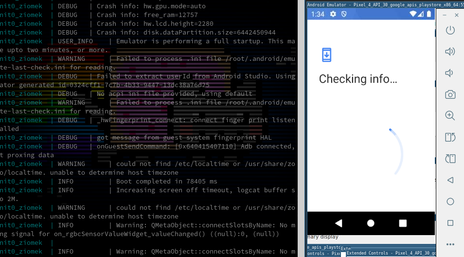

# incognit0_ziomek

## Dockerized Android Emulation Over-VNC and with Split-Tunneled VPN Support for Android Development or Accessing/Testing Apps Not Available in All Regions 

**ziomek translates directly to *compatriot* in Polish**

### Develop, Use, Test Android Apps anywhere, from anywhere, (as if you were anywhere)
[](https://hub.docker.com/r/masonville17/incognit0_ziomek)


##### PROJECT STATE: **working, not perfect, but does the job**

## Getting Started / Setup
### Docker and Docker Compose

[](https://github.com/masonville17/incognit0_ziomek)


## Getting Started / Setup
### Docker and Docker Compose

---
Firstly, you'll need to make sure you have an up to date version of Docker and docker-compose installed.

###**cloning from git repo**
```
git clone https://github.com/masonville17/incognit0_ziomek
cd ./incognit0_ziomek
```

### Secrets/Vpn Configuration

once you have your **```docker-compose.yml```**, you can edit as needed and then finish set-up by placing files containing:
- **openvpn ```passfile```**
- **openvpn ```configfile```**
- **```.env``` file for your preferred VNC password** *(for accessing the virtualized Android host.)*

Ensure that if you dont want to use VPN (cloud install), be sure to set to set ```USE_VPN``` to ```0``` in ```docker-compose.yml```
```
USE_VPN=1
```
**1- on, 0- off**


```
touch vpn/passfile # your ovpn passfile
touch vpn/vpn_host.ovpn # your openvpn config file
touch .env # your environment variables (VNC password)
```

Your **ovpn ```passfile``` will consist of 2 lines** is placed in ```vpn/``` folder and consists of: first, your *username*, and second, your *password* for your chosen VPN provider.
```
openvpn.username@provider.tld # your usual VPN username
your_password # your usual VPN password 
```

**you can place your ovpn config file** in the same ```vpn/``` folder as well will look something like this.
```
client
dev tun
proto udp
remote sub.provider.tld 443
resolv-retry infinite
nobind
persist-key
persist-tun
persist-remote-ip
ca ca.provider.tld.crt
verify-x509-name sub.provider.tld name
auth-user-pass /vpn/passfile
comp-lzo
verb 3
auth SHA256
cipher AES-256-CBC
tls-cipher TLS-DHE-RSA-WITH-AES-256-CBC-SHA:TLS-DHE-DSS-WITH-AES-256-CBC-SHA:TLS-RSA-WITH-AES-256-CBC-SHA
```
**take not to make sure that if there is a ```CA certificate``` provided by your vpn service, that this is placed in the vpn folder as well and named as in your ovpn file.**

## Running

Once we have your ```secrets``` all set up, and placed, ```docker-compose.yml``` is placed, you'll need to then run one of the following commands, depending on docker compose version.
```
docker-compose up -d --build
```
or for newer versions of docker
```
docker compose up -d --build
```
When checking your logs, ```stdout``` should look something like this:
[]

## Troubleshooting / Debugging

**If the incognit0_ziomek container does not seem to be running at this point**, check logs and ensure you have configured openvpn files: ```vpn/passfile``` and ```vpn/vpn_host.ovpn```
This is due to the fact that there is a killswitch on the incognit0_ziomek container, which will kill the container if/when the vpn begins to fail.

---
You will be able to access it over VNC (virtual network client), which means you should be able to use it directly on your ios, windows, linux, or android device (once we get the touch screen over VNC all smoothed over)

 to make ip location tracking easier for folks, otherwise just connect your computer to VPN connection of your choice and run it manually (note this still requires split-tunneling)

Incognit0_ziomek is good for a quick, persisted, and simple android virtualization experience or for testing purposes.

# Plans, Ideas:


make this setup also a cloud-init-able image? perhaps one that only requires vnc password for remote installs
